# Reverse Engineering Agent System - Leverage Point Analysis

## System as a Learning System

This agent system IS ITSELF a system that can be analyzed using Meadows' leverage points. Understanding this helps optimize the system design.

## Leverage Point Mapping

### L1: Transcendence (Highest Leverage)
**The power to transcend paradigms**

```yaml
in_this_system:
  capability: "Question reverse engineering itself"
  
  questions_to_ask:
    - "Is reverse engineering the right approach?"
    - "Should we license instead?"
    - "Should we leapfrog with novel design?"
    
  agent_responsible: Reflector
  
  implementation:
    - Double-loop learning questions in reflection
    - Challenge assumptions about copying vs. innovating
    - Consider when indigenous design is better
```

### L2: Paradigm (Very High Leverage)
**The mindset out of which the system arises**

```yaml
in_this_system:
  paradigm_shift:
    from: "Reverse engineering = measuring parts"
    to: "Reverse engineering = reconstructing decisions"
    
  impact: 10x knowledge extraction
  
  agent_responsible: Modeler + Reflector
  
  implementation:
    - Focus on function structure, not just geometry
    - Extract design philosophy, not just parameters
    - Understand WHY before HOW
```

### L3: Goals (High Leverage)
**The purpose of the system**

```yaml
in_this_system:
  stated_goals:
    - "Understand foreign system"
    - "Enable replication"
    - "Develop counter-systems"
    
  real_goal: "Build indigenous capability faster"
  
  agent_responsible: Orchestrator
  
  implementation:
    - Clear objective classification at project start
    - Goal alignment check in intervention phase
    - Success metrics tied to capability building
```

### L4: Self-Organization (High Leverage)
**The power to change system structure**

```yaml
in_this_system:
  self_organization:
    - Agents can request additional capabilities
    - Workflow can spawn new analysis cycles
    - Knowledge base grows and improves process
    
  agent_responsible: Reflector
  
  implementation:
    - Process improvement recommendations
    - Capability gap identification
    - Tool/skill acquisition planning
```

### L5: Rules (Medium-High Leverage)
**Incentives, punishments, constraints**

```yaml
in_this_system:
  rules:
    - "Document before disassemble"
    - "Function structure before working principles"
    - "Validate models with physical evidence"
    - "Capture lessons before project close"
    
  agent_responsible: All (enforced by Orchestrator)
  
  implementation:
    - State machine transitions enforce sequence
    - Quality gates prevent premature advancement
    - Mandatory reflection phase
```

### L6: Information Flows (Medium-High Leverage)
**Who gets what information when**

```yaml
in_this_system:
  information_architecture:
    diagnostician → modeler: "Physical evidence"
    modeler → interventionist: "Validated models"
    all → reflector: "Complete artifacts"
    reflector → memory: "Persistent lessons"
    
  key_flows:
    - Real-time documentation to Airtable
    - Cross-project knowledge via Memory MCP
    - Part number lookups via Brave Search
    
  agent_responsible: All
  
  implementation:
    - MCP servers as information backbone
    - Structured handoff protocols
    - Knowledge base continuous update
```

### L7: Reinforcing Loops (Medium Leverage)
**Strength of positive feedback loops**

```yaml
in_this_system:
  reinforcing_loops:
    R1_knowledge_accumulation:
      "More analysis → More patterns → Faster analysis"
      strength: STRONG
      
    R2_capability_building:
      "More projects → More skills → Better projects"
      strength: STRONG
      
    R3_paradigm_propagation:
      "Paradigm insights → Mental model updates → Better paradigm recognition"
      strength: MEDIUM
      
  implementation:
    - Knowledge base grows with each project
    - Team capability tracking in Memory MCP
    - Paradigm insights captured and reused
```

### L8: Balancing Loops (Medium Leverage)
**Strength of negative feedback loops**

```yaml
in_this_system:
  balancing_loops:
    B1_quality_control:
      "Incomplete documentation → Gaps detected → More documentation"
      prevents: Premature modeling
      
    B2_model_validation:
      "Model mismatch → Verification request → Model correction"
      prevents: Invalid function structures
      
    B3_scope_control:
      "Project bloat → Timeline pressure → Scope constraint"
      prevents: Analysis paralysis
      
  implementation:
    - Documentation completeness thresholds
    - Model validation checkpoints
    - Timeouts on each phase
```

### L9: Delays (Medium Leverage)
**The lengths of time relative to rates of change**

```yaml
in_this_system:
  delays_to_minimize:
    - Part number lookup (Brave Search: seconds)
    - Knowledge retrieval (Memory MCP: seconds)
    - Documentation access (Airtable: seconds)
    
  delays_to_respect:
    - Physical verification (requires specimen access)
    - Manufacturing capability assessment (external process)
    - Team skill development (months)
    
  implementation:
    - MCP servers provide instant information
    - Parallel processing where possible
    - Async handoffs between agents
```

### L10: Physical Structure (Low-Medium Leverage)
**The physical elements of the system**

```yaml
in_this_system:
  physical_structure:
    - 5 specialized agents
    - 7 MCP servers
    - Airtable databases
    - GitHub repositories
    - Obsidian knowledge base
    
  structure_is_fixed: Once designed, changes are expensive
  
  implementation:
    - Modular agent design
    - Standard interfaces (YAML schemas)
    - Pluggable MCP servers
```

### L11: Buffers (Low Leverage)
**The sizes of stabilizing stocks**

```yaml
in_this_system:
  buffers:
    - Component database (accumulates over projects)
    - Working principle catalog (grows with analysis)
    - Lessons learned repository (compounds value)
    - Team capability inventory (develops over time)
    
  implementation:
    - Knowledge base sizing
    - Database capacity planning
    - Historical data retention
```

### L12: Parameters (Lowest Leverage)
**Numbers that determine behavior**

```yaml
in_this_system:
  parameters:
    - Documentation completeness threshold: 80%
    - Model validation minimum: 90%
    - Phase timeout durations
    - Retry limits
    
  changing_parameters: "Easy but low impact"
  
  implementation:
    - Configuration file
    - Easily adjustable
    - Monitor for appropriate values
```

---

## System Dynamics Model

```
┌─────────────────────────────────────────────────────────────────────────────┐
│                     REVERSE ENGINEERING LEARNING SYSTEM                     │
└─────────────────────────────────────────────────────────────────────────────┘

STOCKS (Accumulations):
┌───────────────────┐     ┌───────────────────┐     ┌───────────────────┐
│   Foreign System  │     │    Knowledge      │     │  Indigenous       │
│   Documentation   │     │    Base           │     │  Capability       │
│   [pages]         │     │   [patterns]      │     │   [level]         │
└─────────┬─────────┘     └─────────┬─────────┘     └─────────┬─────────┘
          │                         │                         │
          ▼                         ▼                         ▼
FLOWS (Rates):
    Documentation Rate          Learning Rate           Capability Growth
    [pages/week]               [patterns/project]       [level/year]
          │                         │                         │
          │         ┌───────────────┼───────────────┐         │
          │         │               │               │         │
          ▼         ▼               ▼               ▼         ▼

REINFORCING LOOPS:

R1: Knowledge Accumulation
    ┌─────────────────────────────────────────┐
    │                                         │
    │   More Analysis ──────► More Patterns   │
    │         ▲                    │          │
    │         │                    │          │
    │         └────── Faster ◄─────┘          │
    │                Analysis                 │
    └─────────────────────────────────────────┘

R2: Capability Building
    ┌─────────────────────────────────────────┐
    │                                         │
    │   More Projects ──────► More Skills     │
    │         ▲                    │          │
    │         │                    │          │
    │         └────── Better ◄─────┘          │
    │                Projects                 │
    └─────────────────────────────────────────┘

R3: Paradigm Propagation
    ┌─────────────────────────────────────────┐
    │                                         │
    │   Paradigm Insight ──► Mental Model     │
    │         ▲               Update          │
    │         │                    │          │
    │         └────── Better ◄─────┘          │
    │              Recognition                │
    └─────────────────────────────────────────┘

BALANCING LOOPS:

B1: Quality Control
    ┌─────────────────────────────────────────┐
    │                                         │
    │   Incomplete Doc ──────► Gap Detection  │
    │         ▲                    │          │
    │         │                    │          │
    │         └────── More Doc ◄───┘          │
    └─────────────────────────────────────────┘

B2: Scope Control
    ┌─────────────────────────────────────────┐
    │                                         │
    │   Project Bloat ──────► Time Pressure   │
    │         ▲                    │          │
    │         │                    │          │
    │         └────── Scope ◄──────┘          │
    │               Constraint                │
    └─────────────────────────────────────────┘
```

---

## Intervention Cascade Design

### Phase 1: Quick Wins (Week 1-2)
**Target: L6 (Information) + L9 (Delays)**

```yaml
interventions:
  - Install MCP servers for instant data access
  - Configure Airtable for real-time tracking
  - Set up GitHub for version control
  
expected_impact: 5x faster information retrieval
monitoring:
  - Query response times
  - Documentation turnaround
  - Handoff completion rates
```

### Phase 2: Structural Lock-in (Week 3-6)
**Target: L5 (Rules) + L7 (Loops)**

```yaml
interventions:
  - Implement state machine transitions
  - Enforce quality gates
  - Activate reinforcing loops (R1, R2, R3)
  
expected_impact: 3x consistency, 2x quality
monitoring:
  - State transition compliance
  - Quality gate pass rates
  - Knowledge base growth rate
```

### Phase 3: Paradigm Shift (Month 2-3)
**Target: L2 (Paradigm) + L3 (Goals)**

```yaml
interventions:
  - Train team on "design archaeology" paradigm
  - Shift from "measurement" to "decision reconstruction"
  - Align goals to capability building
  
expected_impact: 10x knowledge extraction depth
monitoring:
  - Paradigm insights per project
  - Design philosophy reconstructions
  - Cross-project knowledge reuse
```

---

## Success Metrics by Leverage Level

| Level | Metric | Target | Timeframe |
|-------|--------|--------|-----------|
| L12 | Configuration optimized | 100% | Week 1 |
| L11 | Knowledge base seeded | 50 patterns | Month 1 |
| L10 | All agents operational | 5/5 | Week 2 |
| L9 | Query latency | <1 second | Week 1 |
| L8 | Quality gates active | 100% | Week 2 |
| L7 | Reinforcing loops running | 3/3 | Month 1 |
| L6 | Information flows complete | 100% | Week 2 |
| L5 | Rules enforced | 100% | Week 3 |
| L4 | Self-improvement initiated | First cycle | Month 2 |
| L3 | Goals aligned | Verified | Week 1 |
| L2 | Paradigm shift | Team trained | Month 2 |
| L1 | Transcendence | First challenge | Month 3 |

---

## Architecture Visualization (Mermaid)

```mermaid
flowchart TB
    subgraph User["👤 USER"]
        input[/"System to analyze"/]
        output[\"Final Report"\]
    end
    
    subgraph Orchestrator["🎯 ORCHESTRATOR"]
        sm["State Machine"]
        router["Agent Router"]
    end
    
    subgraph Agents["🤖 SPECIALIST AGENTS"]
        diag["📋 DIAGNOSTICIAN\n(D-Phase)"]
        model["🔧 MODELER\n(M-Phase)"]
        inter["⚡ INTERVENTIONIST\n(I-Phase)"]
        refl["🔄 REFLECTOR\n(R-Phase)"]
    end
    
    subgraph MCP["💾 MCP SERVERS"]
        airtable["Airtable\n(Database)"]
        github["GitHub\n(Documentation)"]
        memory["Memory\n(Persistence)"]
        brave["Brave Search\n(Lookup)"]
        seq["Sequential\n(Reasoning)"]
        fs["Filesystem\n(Files)"]
        obs["Obsidian\n(Knowledge)"]
    end
    
    subgraph Skills["📚 SKILLS"]
        pb["Pahl-Beitz"]
        lp["Leverage Points"]
        fl["Feedback Loops"]
        sf["Stock-Flow"]
        dr["Design Review"]
    end
    
    input --> sm
    sm --> router
    router --> diag
    router --> model
    router --> inter
    router --> refl
    
    diag --> |"Physical Data"| model
    model --> |"Validated Models"| inter
    inter --> |"Recommendations"| refl
    refl --> |"Lessons"| sm
    
    diag -.-> airtable & fs & brave & seq
    model -.-> airtable & github & seq & obs
    inter -.-> airtable & github & brave & memory
    refl -.-> airtable & github & memory & obs
    
    diag -.-> sf
    model -.-> pb & fl & sf
    inter -.-> lp & dr
    refl -.-> lp
    
    sm --> output
    
    style Orchestrator fill:#e1f5fe
    style Agents fill:#f3e5f5
    style MCP fill:#e8f5e9
    style Skills fill:#fff3e0
```



---

## Implementation Roadmap

### Week 1: Foundation
```yaml
tasks:
  - [ ] Create Airtable base with all tables
  - [ ] Configure MCP servers
  - [ ] Set up GitHub repository
  - [ ] Test basic handoffs

deliverables:
  - Working MCP infrastructure
  - Empty but configured databases
  - Agent skeleton files
```

### Week 2: Core Agents
```yaml
tasks:
  - [ ] Implement Orchestrator state machine
  - [ ] Implement Diagnostician agent
  - [ ] Implement Modeler agent
  - [ ] Test D→M handoff

deliverables:
  - Orchestrator routing
  - Diagnosis workflow
  - Modeling workflow
```

### Week 3: Complete System
```yaml
tasks:
  - [ ] Implement Interventionist agent
  - [ ] Implement Reflector agent
  - [ ] Full workflow test
  - [ ] Fix integration issues

deliverables:
  - Complete agent system
  - End-to-end workflow
  - Bug fixes
```

### Week 4: Pilot Project
```yaml
tasks:
  - [ ] Select pilot system (suggest: commercial drone)
  - [ ] Execute full D-M-I-R cycle
  - [ ] Capture lessons learned
  - [ ] Refine based on experience

deliverables:
  - First complete analysis
  - Process improvements
  - Validated system
```

---

## Risk Assessment

| Risk | Probability | Impact | Mitigation |
|------|-------------|--------|------------|
| Specimen access limited | High | High | Design for partial access scenarios |
| Unknown components | High | Medium | Brave Search + "custom" fallback |
| Model validation failure | Medium | High | Iterative verification loop |
| Team skill gaps | Medium | Medium | Just-in-time learning + skills |
| Security constraints | Low | High | Classification-aware workflows |

---

## Key Takeaways

1. **This is a learning system, not just an analysis system** - Optimize for capability building

2. **Leverage points matter** - Focus on L2-L6 (paradigm, goals, rules, information) for exponential impact

3. **Reinforcing loops compound** - Knowledge accumulation, capability building, paradigm propagation

4. **D-M-I-R is fractal** - Each agent applies D-M-I-R within its phase

5. **MCP servers are the nervous system** - Information flows determine system effectiveness

6. **Reflection is mandatory** - Without learning, system degrades to linear operation
