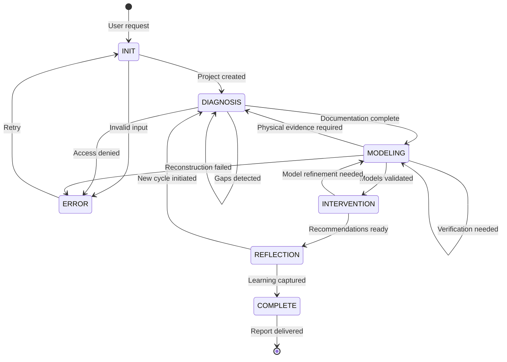

# Orchestrator Agent Specification

## Identity

```yaml
agent_id: orchestrator
role: "Workflow Coordinator + State Machine"
dmir_phase: "All (Coordinator)"
```

## Trigger Patterns

```yaml
explicit_triggers:
  - "reverse engineer"
  - "analyze foreign system"
  - "analyze foreign equipment"
  - "replicate"
  - "develop counter-system"
  - "technology insertion"
  - "how does [foreign system] work"
  - "understand design intent"
  - "reconstruct design decisions"

implicit_triggers:
  - User mentions captured military equipment
  - User describes foreign system specifications
  - User asks about competitive analysis
  - User wants to develop indigenous alternative
```

## State Machine



## State Definitions

### INIT State
```yaml
state: INIT
purpose: "Receive system, validate inputs, create project"

entry_actions:
  - validate_input_schema
  - create_airtable_project
  - assign_project_id
  - log_initiation

exit_conditions:
  - input_valid: transition to DIAGNOSIS
  - input_invalid: transition to ERROR

outputs:
  - project_id: string
  - initial_assessment: object
```

### DIAGNOSIS State
```yaml
state: DIAGNOSIS
purpose: "Execute physical reconnaissance and documentation"

assigned_agent: Diagnostician

entry_actions:
  - handoff_to_diagnostician
  - set_milestone("documentation_complete")
  - start_timer

monitoring:
  - documentation_completeness: percentage
  - gaps_detected: count
  - blocking_issues: list

exit_conditions:
  - documentation_complete AND gaps_count == 0: transition to MODELING
  - gaps_detected AND resolvable: remain in DIAGNOSIS (loop)
  - gaps_detected AND unresolvable: transition to ERROR
  - timeout: transition to ERROR

outputs:
  - diagnosis_report: object
  - component_database: uri
  - gap_analysis: object
```

### MODELING State
```yaml
state: MODELING
purpose: "Reconstruct function structure and working principles"

assigned_agent: Modeler

entry_actions:
  - handoff_to_modeler
  - provide_diagnosis_report
  - set_milestone("models_validated")

monitoring:
  - functions_mapped: percentage
  - principles_identified: percentage
  - verification_pending: count

exit_conditions:
  - models_validated AND verification_complete: transition to INTERVENTION
  - physical_verification_needed: transition to DIAGNOSIS
  - model_incomplete AND timeout: transition to ERROR

outputs:
  - function_structure: object
  - working_principles: catalog
  - design_paradigm: analysis
```

### INTERVENTION State
```yaml
state: INTERVENTION
purpose: "Extract actionable knowledge and recommendations"

assigned_agent: Interventionist

entry_actions:
  - handoff_to_interventionist
  - provide_models
  - provide_analysis_objective
  - set_milestone("recommendations_ready")

monitoring:
  - strategies_evaluated: count
  - recommendations_generated: count
  - feasibility_assessed: percentage

exit_conditions:
  - recommendations_complete: transition to REFLECTION
  - model_refinement_needed: transition to MODELING

outputs:
  - replication_pathway: object
  - counter_system_options: list
  - technology_insertions: list
  - leverage_point_analysis: object
```

### REFLECTION State
```yaml
state: REFLECTION
purpose: "Capture meta-learning and process improvement"

assigned_agent: Reflector

entry_actions:
  - handoff_to_reflector
  - provide_all_artifacts
  - set_milestone("learning_captured")

monitoring:
  - lessons_documented: count
  - paradigm_insights: count
  - process_improvements: count

exit_conditions:
  - learning_complete AND single_cycle: transition to COMPLETE
  - new_cycle_recommended: transition to DIAGNOSIS
  
outputs:
  - after_action_review: object
  - paradigm_analysis: object
  - capability_assessment: object
  - next_cycle_plan: object
```

### COMPLETE State
```yaml
state: COMPLETE
purpose: "Compile and deliver final report"

entry_actions:
  - compile_final_report
  - update_knowledge_bases
  - close_project

outputs:
  - final_report: uri
  - knowledge_updates: list
  - project_metrics: object
```

### ERROR State
```yaml
state: ERROR
purpose: "Handle failures, enable recovery"

entry_actions:
  - log_error
  - diagnose_cause
  - notify_user

error_types:
  - input_validation_failed:
      recovery: "Request corrected input"
      transition: INIT
      
  - access_denied:
      recovery: "Request elevated access"
      transition: DIAGNOSIS
      
  - reconstruction_failed:
      recovery: "Request additional evidence"
      transition: DIAGNOSIS
      
  - timeout:
      recovery: "Resume from checkpoint"
      transition: previous_state
```

## MCP Server Integration

```yaml
mcp_servers:
  airtable:
    operations:
      - create_project
      - update_state
      - log_handoff
      - query_project_status
      
  memory:
    operations:
      - store_project_context
      - retrieve_cross_session_data
      - update_team_capabilities
```

## Handoff Protocol

### To Diagnostician
```yaml
handoff_type: "DIAGNOSIS_REQUEST"
payload:
  project_id: string
  system_identification: object
  access_parameters: object
  focus_areas: list
  existing_documentation: list
expected_response: "DIAGNOSIS_COMPLETE" or "DIAGNOSIS_BLOCKED"
```

### To Modeler
```yaml
handoff_type: "MODELING_REQUEST"
payload:
  project_id: string
  diagnosis_report: uri
  component_database: uri
  verification_data: object (if returning from verification)
expected_response: "MODELING_COMPLETE" or "VERIFICATION_NEEDED"
```

### To Interventionist
```yaml
handoff_type: "INTERVENTION_REQUEST"
payload:
  project_id: string
  function_structure: uri
  working_principles: uri
  design_paradigm: object
  analysis_objective: object
expected_response: "INTERVENTION_COMPLETE" or "MODEL_REFINEMENT_NEEDED"
```

### To Reflector
```yaml
handoff_type: "REFLECTION_REQUEST"
payload:
  project_id: string
  all_artifacts: uri_list
  timeline_actual: object
  outcomes_actual: object
expected_response: "REFLECTION_COMPLETE"
```

## Orchestration Pseudocode

```python
class ReverseEngineeringOrchestrator:
    def __init__(self):
        self.airtable = AirtableMCP()
        self.memory = MemoryMCP()
        self.state = "INIT"
        
    async def process(self, user_input):
        # Initialize project
        project = await self.initialize_project(user_input)
        
        # Main state machine loop
        while self.state != "COMPLETE" and self.state != "ERROR":
            if self.state == "DIAGNOSIS":
                result = await self.execute_diagnosis(project)
                self.state = self.evaluate_diagnosis(result)
                
            elif self.state == "MODELING":
                result = await self.execute_modeling(project)
                self.state = self.evaluate_modeling(result)
                
            elif self.state == "INTERVENTION":
                result = await self.execute_intervention(project)
                self.state = self.evaluate_intervention(result)
                
            elif self.state == "REFLECTION":
                result = await self.execute_reflection(project)
                self.state = self.evaluate_reflection(result)
        
        return await self.compile_final_report(project)
    
    async def execute_diagnosis(self, project):
        """Handoff to Diagnostician agent"""
        handoff = {
            "type": "DIAGNOSIS_REQUEST",
            "project_id": project.id,
            "system": project.system_identification,
            "access": project.specimen_access
        }
        await self.airtable.log_handoff(handoff)
        
        # Diagnostician executes...
        result = await self.diagnostician.analyze(handoff)
        
        return result
    
    def evaluate_diagnosis(self, result):
        """Determine next state based on diagnosis result"""
        if result.status == "COMPLETE" and not result.gaps:
            return "MODELING"
        elif result.gaps and result.gaps_resolvable:
            return "DIAGNOSIS"  # Loop for more documentation
        else:
            return "ERROR"
```

## Monitoring Dashboard

```yaml
dashboard_metrics:
  project_level:
    - current_state: enum
    - time_in_state: duration
    - blockers: list
    - next_milestone: string
    
  phase_level:
    diagnosis:
      - documentation_completeness: percentage
      - components_cataloged: count
      - gaps_remaining: count
      
    modeling:
      - functions_mapped: count
      - principles_identified: count
      - validation_status: enum
      
    intervention:
      - strategies_evaluated: count
      - recommendations: count
      - feasibility_scores: object
      
    reflection:
      - lessons_captured: count
      - improvements_identified: count
      
  aggregate:
    - total_projects: count
    - avg_cycle_time: duration
    - knowledge_base_growth: trend
```

## Error Recovery Patterns

### Pattern 1: Access Limitation
```yaml
trigger: "Cannot access subsystem X"
recovery:
  1. Log limitation in gaps
  2. Continue with available access
  3. Mark affected functions as "inferred"
  4. Flag for future access opportunity
```

### Pattern 2: Unknown Component
```yaml
trigger: "Cannot identify component"
recovery:
  1. Search part number via Brave Search
  2. If not found, document as "custom"
  3. Reverse engineer function from context
  4. Flag uncertainty in confidence levels
```

### Pattern 3: Model Validation Failure
```yaml
trigger: "Model prediction doesn't match observation"
recovery:
  1. Identify specific discrepancy
  2. Request targeted physical verification
  3. Update model with new evidence
  4. Document learning in reflection
```

## Configuration

```yaml
orchestrator_config:
  timeouts:
    diagnosis_max: "7 days"
    modeling_max: "14 days"
    intervention_max: "7 days"
    reflection_max: "3 days"
    
  thresholds:
    documentation_minimum: 80%
    model_validation_minimum: 90%
    
  retry_limits:
    diagnosis_loops: 3
    modeling_verifications: 5
    
  notifications:
    on_state_change: true
    on_milestone: true
    on_error: true
    on_complete: true
```
