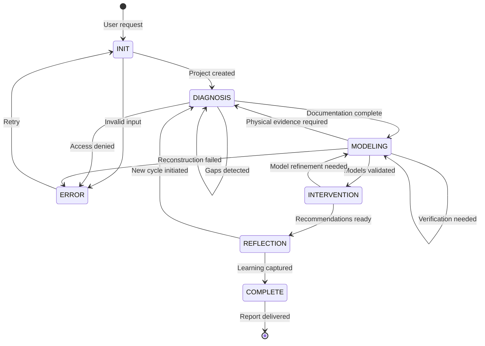

# Orchestrator Agent Specification

## Identity

```yaml
agent_id: orchestrator
role: "Workflow Coordinator + State Machine"
dmir_phase: "All (Coordinator)"
```

## Trigger Patterns

```yaml
explicit_triggers:
  - "reverse engineer"
  - "analyze foreign system"
  - "analyze foreign equipment"
  - "replicate"
  - "develop counter-system"
  - "technology insertion"
  - "how does [foreign system] work"
  - "understand design intent"
  - "reconstruct design decisions"

implicit_triggers:
  - User mentions captured military equipment
  - User describes foreign system specifications
  - User asks about competitive analysis
  - User wants to develop indigenous alternative
```

## State Machine



## State Definitions

### INIT State
```yaml
state: INIT
purpose: "Receive system, validate inputs, create project"

entry_actions:
  - validate_input_schema
  - create_airtable_project
  - assign_project_id
  - log_initiation

exit_conditions:
  - input_valid: transition to DIAGNOSIS
  - input_invalid: transition to ERROR

outputs:
  - project_id: string
  - initial_assessment: object
```

### DIAGNOSIS State
```yaml
state: DIAGNOSIS
purpose: "Execute physical reconnaissance and documentation"

assigned_agent: Diagnostician

entry_actions:
  - handoff_to_diagnostician
  - set_milestone("documentation_complete")
  - start_timer

monitoring:
  - documentation_completeness: percentage
  - gaps_detected: count
  - blocking_issues: list

exit_conditions:
  - documentation_complete AND gaps_count == 0: transition to MODELING
  - gaps_detected AND resolvable: remain in DIAGNOSIS (loop)
  - gaps_detected AND unresolvable: transition to ERROR
  - timeout: transition to ERROR

outputs:
  - diagnosis_report: object
  - component_database: uri
  - gap_analysis: object
```

### MODELING State
```yaml
state: MODELING
purpose: "Reconstruct function structure and working principles"

assigned_agent: Modeler

entry_actions:
  - handoff_to_modeler
  - provide_diagnosis_report
  - set_milestone("models_validated")

monitoring:
  - functions_mapped: percentage
  - principles_identified: percentage
  - verification_pending: count

exit_conditions:
  - models_validated AND verification_complete: transition to INTERVENTION
  - physical_verification_needed: transition to DIAGNOSIS
  - model_incomplete AND timeout: transition to ERROR

outputs:
  - function_structure: object
  - working_principles: catalog
  - design_paradigm: analysis
```

### INTERVENTION State
```yaml
state: INTERVENTION
purpose: "Extract actionable knowledge and recommendations"

assigned_agent: Interventionist

entry_actions:
  - handoff_to_interventionist
  - provide_models
  - provide_analysis_objective
  - set_milestone("recommendations_ready")

monitoring:
  - strategies_evaluated: count
  - recommendations_generated: count
  - feasibility_assessed: percentage

exit_conditions:
  - recommendations_complete: transition to REFLECTION
  - model_refinement_needed: transition to MODELING

outputs:
  - replication_pathway: object
  - counter_system_options: list
  - technology_insertions: list
  - leverage_point_analysis: object
```

### REFLECTION State
```yaml
state: REFLECTION
purpose: "Capture meta-learning and process improvement"

assigned_agent: Reflector

entry_actions:
  - handoff_to_reflector
  - provide_all_artifacts
  - set_milestone("learning_captured")

monitoring:
  - lessons_documented: count
  - paradigm_insights: count
  - process_improvements: count

exit_conditions:
  - learning_complete AND single_cycle: transition to COMPLETE
  - new_cycle_recommended: transition to DIAGNOSIS
  
outputs:
  - after_action_review: object
  - paradigm_analysis: object
  - capability_assessment: object
  - next_cycle_plan: object
```

### COMPLETE State
```yaml
state: COMPLETE
purpose: "Compile and deliver final report"

entry_actions:
  - compile_final_report
  - update_knowledge_bases
  - close_project

outputs:
  - final_report: uri
  - knowledge_updates: list
  - project_metrics: object
```

### ERROR State
```yaml
state: ERROR
purpose: "Handle failures, enable recovery"

entry_actions:
  - log_error
  - diagnose_cause
  - notify_user

error_types:
  - input_validation_failed:
      recovery: "Request corrected input"
      transition: INIT
      
  - access_denied:
      recovery: "Request elevated access"
      transition: DIAGNOSIS
      
  - reconstruction_failed:
      recovery: "Request additional evidence"
      transition: DIAGNOSIS
      
  - timeout:
      recovery: "Resume from checkpoint"
      transition: previous_state
```

## MCP Server Integration

```yaml
mcp_servers:
  airtable:
    operations:
      - create_project
      - update_state
      - log_handoff
      - query_project_status
      
  memory:
    operations:
      - store_project_context
      - retrieve_cross_session_data
      - update_team_capabilities
```

## Handoff Protocol

### To Diagnostician
```yaml
handoff_type: "DIAGNOSIS_REQUEST"
payload:
  project_id: string
  system_identification: object
  access_parameters: object
  focus_areas: list
  existing_documentation: list
expected_response: "DIAGNOSIS_COMPLETE" or "DIAGNOSIS_BLOCKED"
```

### To Modeler
```yaml
handoff_type: "MODELING_REQUEST"
payload:
  project_id: string
  diagnosis_report: uri
  component_database: uri
  verification_data: object (if returning from verification)
expected_response: "MODELING_COMPLETE" or "VERIFICATION_NEEDED"
```

### To Interventionist
```yaml
handoff_type: "INTERVENTION_REQUEST"
payload:
  project_id: string
  function_structure: uri
  working_principles: uri
  design_paradigm: object
  analysis_objective: object
expected_response: "INTERVENTION_COMPLETE" or "MODEL_REFINEMENT_NEEDED"
```

### To Reflector
```yaml
handoff_type: "REFLECTION_REQUEST"
payload:
  project_id: string
  all_artifacts: uri_list
  timeline_actual: object
  outcomes_actual: object
expected_response: "REFLECTION_COMPLETE"
```

## Orchestration Pseudocode

```python
class ReverseEngineeringOrchestrator:
    def __init__(self):
        self.airtable = AirtableMCP()
        self.memory = MemoryMCP()
        self.state = "INIT"
        
    async def process(self, user_input):
        # Initialize project
        project = await self.initialize_project(user_input)
        
        # Main state machine loop
        while self.state != "COMPLETE" and self.state != "ERROR":
            if self.state == "DIAGNOSIS":
                result = await self.execute_diagnosis(project)
                self.state = self.evaluate_diagnosis(result)
                
            elif self.state == "MODELING":
                result = await self.execute_modeling(project)
                self.state = self.evaluate_modeling(result)
                
            elif self.state == "INTERVENTION":
                result = await self.execute_intervention(project)
                self.state = self.evaluate_intervention(result)
                
            elif self.state == "REFLECTION":
                result = await self.execute_reflection(project)
                self.state = self.evaluate_reflection(result)
        
        return await self.compile_final_report(project)
    
    async def execute_diagnosis(self, project):
        """Handoff to Diagnostician agent"""
        handoff = {
            "type": "DIAGNOSIS_REQUEST",
            "project_id": project.id,
            "system": project.system_identification,
            "access": project.specimen_access
        }
        await self.airtable.log_handoff(handoff)
        
        # Diagnostician executes...
        result = await self.diagnostician.analyze(handoff)
        
        return result
    
    def evaluate_diagnosis(self, result):
        """Determine next state based on diagnosis result"""
        if result.status == "COMPLETE" and not result.gaps:
            return "MODELING"
        elif result.gaps and result.gaps_resolvable:
            return "DIAGNOSIS"  # Loop for more documentation
        else:
            return "ERROR"
```

## Monitoring Dashboard

```yaml
dashboard_metrics:
  project_level:
    - current_state: enum
    - time_in_state: duration
    - blockers: list
    - next_milestone: string
    
  phase_level:
    diagnosis:
      - documentation_completeness: percentage
      - components_cataloged: count
      - gaps_remaining: count
      
    modeling:
      - functions_mapped: count
      - principles_identified: count
      - validation_status: enum
      
    intervention:
      - strategies_evaluated: count
      - recommendations: count
      - feasibility_scores: object
      
    reflection:
      - lessons_captured: count
      - improvements_identified: count
      
  aggregate:
    - total_projects: count
    - avg_cycle_time: duration
    - knowledge_base_growth: trend
```

## Error Recovery Patterns

### Pattern 1: Access Limitation
```yaml
trigger: "Cannot access subsystem X"
recovery:
  1. Log limitation in gaps
  2. Continue with available access
  3. Mark affected functions as "inferred"
  4. Flag for future access opportunity
```

### Pattern 2: Unknown Component
```yaml
trigger: "Cannot identify component"
recovery:
  1. Search part number via Brave Search
  2. If not found, document as "custom"
  3. Reverse engineer function from context
  4. Flag uncertainty in confidence levels
```

### Pattern 3: Model Validation Failure
```yaml
trigger: "Model prediction doesn't match observation"
recovery:
  1. Identify specific discrepancy
  2. Request targeted physical verification
  3. Update model with new evidence
  4. Document learning in reflection
```

## Configuration

```yaml
orchestrator_config:
  timeouts:
    diagnosis_max: "7 days"
    modeling_max: "14 days"
    intervention_max: "7 days"
    reflection_max: "3 days"
    idle_timeout: "48 hours"

  thresholds:
    documentation_minimum: 80%
    model_validation_minimum: 90%
    recommendation_confidence_minimum: 70%

  retry_limits:
    diagnosis_loops: 3
    modeling_verifications: 5
    intervention_refinements: 3

  notifications:
    on_state_change: true
    on_milestone: true
    on_error: true
    on_complete: true
    on_escalation: true
```

## Feedback Loop Controls

### Loop Termination Conditions

```yaml
loop_controls:
  global:
    max_project_duration: "30 days"
    max_total_iterations: 20
    idle_timeout: "48 hours"
    description: "Global limits apply across all loops"

  diagnosis_loop:
    max_iterations: 3
    improvement_threshold: 10%
    description: "Must improve documentation by at least 10% each iteration"
    termination_conditions:
      - documentation_completeness >= 80%
      - max_iterations_reached
      - no_progress_after_iteration
      - blocking_issue_unresolvable
    on_max_iterations: "ESCALATE"
    on_no_progress: "ESCALATE"

  modeling_verification_loop:
    max_iterations: 5
    batch_size: 3
    diminishing_returns_threshold: 5%
    description: "Verify up to 3 hypotheses per round, max 5 rounds"
    termination_conditions:
      - all_blocking_hypotheses_verified
      - validation_score >= 90%
      - max_iterations_reached
      - diminishing_returns_detected
    on_max_iterations: "PROCEED_WITH_CAVEATS"
    on_diminishing_returns: "PROCEED_WITH_CAVEATS"

  intervention_refinement_loop:
    max_iterations: 3
    significance_threshold: "blocking"
    description: "Only loop for blocking refinements"
    termination_conditions:
      - all_blocking_refinements_complete
      - max_iterations_reached
    on_max_iterations: "ESCALATE"

  reflection_cycle_loop:
    max_new_cycles: 2
    description: "Limit re-analysis to 2 additional cycles"
    termination_conditions:
      - no_new_cycle_recommended
      - max_cycles_reached
    on_max_cycles: "FORCE_COMPLETE"
```

### Progress Tracking

```yaml
progress_metrics:
  per_iteration:
    iteration_number: integer
    state: string
    timestamp_start: datetime
    timestamp_end: datetime
    metrics_before:
      completeness: percentage
      confidence: percentage
    metrics_after:
      completeness: percentage
      confidence: percentage
    improvement: percentage

  progress_detection:
    no_progress_definition: "improvement < improvement_threshold for 2 consecutive iterations"
    diminishing_returns_definition: "improvement < diminishing_returns_threshold"

  loop_history:
    - iteration: number
      from_state: string
      to_state: string
      timestamp: datetime
      duration_seconds: number
      metrics: object
      outcome: enum [continued, completed, escalated, timed_out]
```

## Escalation Procedures

### Escalation Triggers

```yaml
escalation_triggers:
  automatic:
    - condition: "max_iterations_exceeded"
      severity: "high"
      escalate_to: "human_operator"

    - condition: "no_progress_detected"
      severity: "medium"
      escalate_to: "project_lead"

    - condition: "timeout_exceeded"
      severity: "high"
      escalate_to: "human_operator"

    - condition: "blocking_issue_unresolvable"
      severity: "critical"
      escalate_to: "project_lead"

    - condition: "verification_contradicted_model_3_times"
      severity: "high"
      escalate_to: "project_lead"

    - condition: "error_state_entered_3_times"
      severity: "critical"
      escalate_to: "system_admin"

  severity_levels:
    low:
      response_time: "24 hours"
      notification: "log_only"
    medium:
      response_time: "4 hours"
      notification: "dashboard_alert"
    high:
      response_time: "1 hour"
      notification: "email + dashboard"
    critical:
      response_time: "15 minutes"
      notification: "all_channels"
```

### Escalation Actions

```yaml
escalation_actions:
  ESCALATE_TO_HUMAN:
    action: "Pause processing and await human decision"
    state_transition: "ESCALATED"
    data_package:
      - current_state
      - iteration_history
      - loop_metrics
      - blocking_issues
      - partial_results
      - recommended_options
    notification:
      recipients: ["project_lead", "technical_director"]
      channels: ["email", "dashboard"]
      urgency: "high"
    timeout: "72 hours"
    on_timeout: "FORCE_TERMINATE"

  PAUSE_AND_ASSESS:
    action: "Pause for assessment without full escalation"
    state_transition: "PAUSED"
    assessment_questions:
      - "Is the objective achievable with current access?"
      - "Are there alternative approaches?"
      - "Should parameters be adjusted?"
      - "Is additional expertise needed?"
    auto_resume_conditions:
      - "assessment_complete"
      - "human_override"
    max_pause_duration: "48 hours"

  PROCEED_WITH_CAVEATS:
    action: "Continue to next phase with documented limitations"
    state_transition: "next_state"
    caveats_required:
      - areas_not_fully_validated: list
      - confidence_reductions: object
      - assumptions_made: list
    flag_in_final_report: true

  FORCE_COMPLETE:
    action: "Force project to COMPLETE state with current results"
    state_transition: "COMPLETE"
    documentation_required:
      - incomplete_areas: list
      - reason_for_force_complete: string
      - quality_assessment: object
```

### Human Decision Options

```yaml
human_decision_options:
  on_max_iterations:
    - option: "Force completion with current results"
      action: "FORCE_COMPLETE"
    - option: "Grant additional iterations"
      action: "RESET_ITERATION_COUNT"
      parameters: [additional_iterations: number]
    - option: "Change approach"
      action: "MODIFY_PARAMETERS"
      parameters: [new_focus_areas: list]
    - option: "Terminate project"
      action: "TERMINATE"

  on_blocking_issue:
    - option: "Proceed without blocked area"
      action: "PROCEED_WITH_CAVEATS"
    - option: "Request additional access"
      action: "REQUEST_ACCESS"
    - option: "Assign specialist"
      action: "ASSIGN_SPECIALIST"
    - option: "Terminate project"
      action: "TERMINATE"
```

## Enhanced State Machine with Guards

### State Machine Implementation

```python
class ReverseEngineeringOrchestrator:
    """Enhanced orchestrator with loop controls and escalation"""

    # Configuration
    MAX_TOTAL_ITERATIONS = 20
    MAX_PROJECT_DURATION_DAYS = 30
    IDLE_TIMEOUT_HOURS = 48

    def __init__(self):
        self.airtable = AirtableMCP()
        self.memory = MemoryMCP()
        self.state = "INIT"
        self.iteration_count = 0
        self.loop_history = []
        self.checkpoints = []
        self.start_time = None

    async def process(self, user_input):
        """Main processing loop with guards"""
        project = await self.initialize_project(user_input)
        self.start_time = datetime.now()

        while self.state not in ["COMPLETE", "ERROR", "ESCALATED", "TERMINATED"]:
            # === GUARD: Maximum iterations ===
            self.iteration_count += 1
            if self.iteration_count > self.MAX_TOTAL_ITERATIONS:
                await self.escalate("MAX_ITERATIONS_EXCEEDED", project)
                break

            # === GUARD: Project duration ===
            if self._check_project_timeout():
                await self.escalate("PROJECT_TIMEOUT", project)
                break

            # === GUARD: No progress detection ===
            if self._detect_no_progress():
                await self.escalate("NO_PROGRESS", project)
                break

            # === GUARD: Idle timeout ===
            if await self._check_idle_timeout(project):
                await self.escalate("IDLE_TIMEOUT", project)
                break

            # Record state before execution
            previous_state = self.state
            iteration_start = datetime.now()
            metrics_before = await self._capture_metrics(project)

            # Execute current phase
            try:
                result = await self._execute_current_phase(project)
            except Exception as e:
                await self._handle_execution_error(e, project)
                continue

            # Evaluate result and determine next state
            new_state = self._evaluate_result(result)
            metrics_after = await self._capture_metrics(project)

            # Record loop history
            self.loop_history.append({
                "iteration": self.iteration_count,
                "from_state": previous_state,
                "to_state": new_state,
                "timestamp_start": iteration_start,
                "timestamp_end": datetime.now(),
                "metrics_before": metrics_before,
                "metrics_after": metrics_after,
                "improvement": self._calculate_improvement(metrics_before, metrics_after),
                "result_summary": result.summary if hasattr(result, 'summary') else None
            })

            # Update state
            self.state = new_state

            # Checkpoint after each state transition
            await self._checkpoint(project)

            # Log state transition
            await self._log_state_transition(project, previous_state, new_state)

        return await self.compile_final_report(project)

    def _check_project_timeout(self) -> bool:
        """Check if project has exceeded maximum duration"""
        if self.start_time is None:
            return False
        elapsed = datetime.now() - self.start_time
        return elapsed.days > self.MAX_PROJECT_DURATION_DAYS

    def _detect_no_progress(self) -> bool:
        """Detect if no progress is being made"""
        if len(self.loop_history) < 2:
            return False
        recent = self.loop_history[-2:]
        # No progress if same state and improvement < threshold for 2 iterations
        same_state = recent[0]["from_state"] == recent[1]["from_state"]
        no_improvement = all(h["improvement"] < 0.10 for h in recent)
        return same_state and no_improvement

    async def _check_idle_timeout(self, project) -> bool:
        """Check if project has been idle too long"""
        last_activity = await self.airtable.get_last_activity(project.id)
        if last_activity is None:
            return False
        elapsed = datetime.now() - last_activity
        return elapsed.total_seconds() > (self.IDLE_TIMEOUT_HOURS * 3600)

    def _calculate_improvement(self, before: dict, after: dict) -> float:
        """Calculate improvement percentage between metrics"""
        if "completeness" in before and "completeness" in after:
            return (after["completeness"] - before["completeness"]) / 100
        return 0.0

    async def escalate(self, reason: str, project):
        """Escalate to human decision-maker"""
        self.state = "ESCALATED"

        escalation_data = {
            "project_id": project.id,
            "reason": reason,
            "iteration_count": self.iteration_count,
            "loop_history": self.loop_history,
            "current_metrics": await self._capture_metrics(project),
            "timestamp": datetime.now(),
            "recommended_options": self._get_escalation_options(reason)
        }

        await self.airtable.log_escalation(escalation_data)
        await self._notify_stakeholders(reason, project)

    async def _checkpoint(self, project):
        """Save checkpoint for recovery"""
        checkpoint = {
            "checkpoint_id": str(uuid.uuid4()),
            "project_id": project.id,
            "timestamp": datetime.now(),
            "state": self.state,
            "iteration_count": self.iteration_count,
            "loop_history": self.loop_history,
            "artifacts": await self._collect_artifact_refs(project)
        }
        self.checkpoints.append(checkpoint)
        await self.airtable.save_checkpoint(checkpoint)

    async def recover_from_checkpoint(self, checkpoint_id: str):
        """Restore state from checkpoint"""
        checkpoint = await self.airtable.load_checkpoint(checkpoint_id)
        self.state = checkpoint["state"]
        self.iteration_count = checkpoint["iteration_count"]
        self.loop_history = checkpoint["loop_history"]
        # Verify artifact integrity before resuming
        await self._verify_artifacts(checkpoint["artifacts"])
```

## Concurrent Project Management

```yaml
concurrency_model:
  project_isolation:
    description: "Each project runs in isolated context"
    guarantees:
      - separate_state_machine_instance
      - separate_airtable_records
      - separate_checkpoints
      - separate_loop_history

  resource_sharing:
    mcp_servers:
      airtable:
        sharing: "connection_pooled"
        max_connections: 10
        timeout_per_request: 30
      github:
        sharing: "project_scoped"
        rate_limit_aware: true
      memory:
        sharing: "namespaced_by_project"
      brave_search:
        sharing: "rate_limited"
        requests_per_minute: 30
      sequential_thinking:
        sharing: "per_request"

  scheduling:
    max_concurrent_projects: 3
    priority_queue:
      order:
        1: "critical priority projects"
        2: "high priority projects"
        3: "time-sensitive operations"
        4: "round-robin for equal priority"

  conflict_resolution:
    knowledge_base_updates:
      strategy: "optimistic_locking"
      on_conflict: "merge_if_possible_else_manual"
    shared_artifacts:
      strategy: "copy_on_write"
```

## Interface Contract

```yaml
interface_contract:
  input_validation:
    required_fields:
      - system_identification.designation: "non-empty string"
      - system_identification.origin_country: "non-empty string"
      - analysis_objective.primary_goal: "valid enum value"
      - specimen_access.location: "non-empty string"
    validation_errors:
      - MISSING_DESIGNATION: "System designation is required"
      - MISSING_ORIGIN: "Origin country is required"
      - INVALID_OBJECTIVE: "Primary goal must be one of: replicate, counter, insert_tech, understand"

  output_guarantees:
    on_complete:
      - final_report: "valid URI to compiled report"
      - project_metrics: "complete metrics object"
      - knowledge_updates: "list of updates made"
    on_escalated:
      - escalation_reason: "string describing why escalated"
      - current_state: "last known good state"
      - partial_results: "any completed work"
    on_error:
      - error_code: "from error-schema.yaml"
      - error_message: "human-readable description"
      - recovery_options: "list of possible recovery actions"

  idempotency:
    behavior: "Re-running with same input resumes from checkpoint if exists"
    side_effects:
      - Airtable project record created/updated
      - Handoff logs created
      - Checkpoints saved
      - Agent handoffs triggered
```
