# RE Agent System Architecture

## System Overview

```mermaid
flowchart TB
    subgraph External["External Inputs"]
        USER[("👤 Human Operator")]
        SPECIMEN["📦 Physical Specimen"]
    end

    subgraph Orchestration["Orchestration Layer"]
        ORCH["🎯 ORCHESTRATOR<br/>State Machine + Loop Control"]
    end

    subgraph Agents["Specialist Agents"]
        DIAG["🔍 DIAGNOSTICIAN<br/>Physical Reconnaissance"]
        MOD["📐 MODELER<br/>Function Structure"]
        INT["⚡ INTERVENTIONIST<br/>Application Strategy"]
        REF["🪞 REFLECTOR<br/>Meta-Learning"]
    end

    subgraph Storage["Persistent Storage"]
        AT[("🗄️ Airtable<br/>Structured Data")]
        GH[("📁 GitHub<br/>Artifacts/Docs")]
        MEM[("🧠 Memory<br/>Cross-Project")]
    end

    subgraph MCPServers["MCP Servers"]
        MCP_AT["airtable-mcp"]
        MCP_GH["github-mcp"]
        MCP_FS["filesystem-mcp"]
        MCP_BR["brave-search-mcp"]
        MCP_SEQ["sequential-thinking"]
        MCP_MEM["memory-mcp"]
        MCP_OBS["obsidian-mcp"]
    end

    USER -->|"Project Request"| ORCH
    SPECIMEN -->|"Physical Access"| DIAG

    ORCH <-->|"Handoffs"| DIAG
    ORCH <-->|"Handoffs"| MOD
    ORCH <-->|"Handoffs"| INT
    ORCH <-->|"Handoffs"| REF

    DIAG -.->|"Verification Loop"| MOD

    Agents --> MCP_AT --> AT
    Agents --> MCP_GH --> GH
    Agents --> MCP_MEM --> MEM
    Agents --> MCP_FS
    Agents --> MCP_BR
    Agents --> MCP_SEQ
    REF --> MCP_OBS

    ORCH -->|"Escalation"| USER
```

## State Machine Flow

```mermaid
stateDiagram-v2
    [*] --> INIT: Project Created

    INIT --> DIAGNOSIS: Start Analysis

    DIAGNOSIS --> MODELING: Documentation Complete<br/>(≥80% completeness)
    DIAGNOSIS --> DIAGNOSIS: Gap Detected<br/>(max 3 iterations)

    MODELING --> INTERVENTION: Models Validated<br/>(≥90% validation)
    MODELING --> DIAGNOSIS: Verification Needed
    MODELING --> MODELING: Refinement Loop<br/>(max 5 iterations)

    INTERVENTION --> REFLECTION: Recommendations Ready
    INTERVENTION --> MODELING: Model Refinement Needed

    REFLECTION --> COMPLETE: Project Closure
    REFLECTION --> DIAGNOSIS: New Cycle Recommended

    DIAGNOSIS --> ERROR: Unrecoverable Error
    MODELING --> ERROR: Unrecoverable Error
    INTERVENTION --> ERROR: Unrecoverable Error
    REFLECTION --> ERROR: Unrecoverable Error

    DIAGNOSIS --> ESCALATED: Human Required
    MODELING --> ESCALATED: Human Required
    INTERVENTION --> ESCALATED: Human Required
    REFLECTION --> ESCALATED: Human Required

    ERROR --> [*]
    ESCALATED --> [*]
    COMPLETE --> [*]
```

## Agent Communication Protocol

## Data Flow Architecture

## Handoff Protocol (ACK/NACK)

## Error Handling & Escalation

## Checkpoint & Recovery

## MCP Server Integration

```mermaid
flowchart TB
    subgraph Agents["RE Agents"]
        ORCH["Orchestrator"]
        DIAG["Diagnostician"]
        MOD["Modeler"]
        INT["Interventionist"]
        REF["Reflector"]
    end

    subgraph Required["Required MCP Servers"]
        AT["🗄️ Airtable MCP<br/>Structured data storage"]
        GH["📁 GitHub MCP<br/>Artifact versioning"]
        FS["📂 Filesystem MCP<br/>Local file access"]
        BR["🔍 Brave Search MCP<br/>Part/spec lookup"]
        SEQ["🧠 Sequential Thinking<br/>Multi-step reasoning"]
        MEM["💾 Memory MCP<br/>Cross-project knowledge"]
    end

    subgraph Optional["Optional MCP Servers"]
        OBS["📝 Obsidian MCP<br/>Knowledge notes"]
        QC["📊 QuickChart MCP<br/>Visualizations"]
        MER["🎨 Mermaid MCP<br/>Diagrams"]
    end

    ORCH --> AT & GH & MEM
    DIAG --> AT & FS & BR & SEQ
    MOD --> AT & GH & SEQ & OBS
    INT --> AT & GH & BR & MEM
    REF --> AT & GH & MEM & OBS

    MOD -.-> QC & MER
```

## Airtable Schema

## Loop Control & Termination

---

## Quick Reference

| Component | Purpose | Key Files |
|-----------|---------|-----------|
| Orchestrator | State machine, routing, escalation | `agents/orchestrator.md` |
| Diagnostician | Physical documentation | `agents/diagnostician.md` |
| Modeler | Function structure reconstruction | `agents/modeler.md` |
| Interventionist | Application strategy | `agents/interventionist.md` |
| Reflector | Meta-learning, knowledge capture | `agents/reflector.md` |
| Handoff Schema | Message formats | `schemas/handoff-schema.yaml` |
| Error Schema | Error codes & recovery | `schemas/error-schema.yaml` |
| Checkpoint Schema | State persistence | `schemas/checkpoint-schema.yaml` |

---

*Generated: 2025-12-23*
