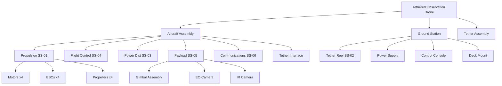

# Diagnosis Report: Tethered Observation Drone

## Metadata

```yaml
project_id: "receqh6y4Pzq6OMdt"
system_designation: "Tethered Observation Drone (TOD)"
documentation_date: "2025-12-22"
analyst: "Diagnostician Agent"
classification: "INTERNAL"
dmir_phase: "DIAGNOSIS"
origin: "Vietnam (Indigenous Development)"
application: "Naval Observation Platform"
```

## Executive Summary

The Tethered Observation Drone (TOD) is an indigenous Vietnamese development for naval vessel-based persistent surveillance. Unlike free-flying UAVs, tethered drones provide continuous power and high-bandwidth data via physical tether, enabling unlimited endurance for maritime situational awareness.

---

## Level 1: External Observation

### 1.1 Overall Dimensions (Estimated)

```yaml
dimensional:
  overall_dimensions:
    length: 800 mm       # Propeller tip-to-tip diagonal
    width: 800 mm
    height: 450 mm       # Including landing gear
  weight:
    airframe_only: 3.5 kg
    with_payload: 5.5 kg
    tether_per_100m: 2.0 kg
  center_of_gravity: [0, 0, -50]  # Below geometric center for stability
```

### 1.2 Configuration

```yaml
platform_configuration:
  type: "Quadrotor"
  motor_arrangement: "X-configuration"
  propeller_count: 4
  propeller_diameter: 380 mm (15 inch)
  tether_attachment: "Center-mounted swivel with strain relief"
```

### 1.3 External Interfaces

```yaml
interfaces:
  electrical_connectors:
    - connector_id: "PWR-TETHER"
      type: "Integrated in tether"
      voltage: "48V DC"
      current_rating: "20A max"
      function: "Power supply from ground station"

    - connector_id: "DATA-TETHER"
      type: "Fiber optic pair"
      protocol: "Ethernet 1Gbps"
      function: "HD video + telemetry"

  tether_interface:
    - interface_id: "TETHER-MAIN"
      type: "Composite tether (power + fiber + kevlar)"
      diameter: "6mm"
      breaking_strength: "100 kg"
      max_length: "150m"
      connector_type: "Quick-release with automatic disconnect"

  ground_station_interface:
    - interface_id: "GS-MOUNT"
      type: "Naval deck mount"
      attachment: "4-point quick-release"
      weatherproofing: "IP67"
```

### 1.4 Markings & Identification

```yaml
markings:
  manufacturer_labels:
    - text: "UXVina JSC"
      location: "Upper frame plate"

  part_numbers:
    - number: "TOD-NV-001"
      type: "internal_designation"
      decoded:
        TOD: "Tethered Observation Drone"
        NV: "Naval Version"
        001: "Initial prototype"

  safety_warnings:
    - text: "CAUTION: Rotating blades"
      language: "Vietnamese/English"
    - text: "48V DC - High Current"
      language: "Vietnamese/English"
```

### 1.5 Visible Materials

```yaml
materials:
  visible_materials:
    - component: "Main frame"
      material: "Carbon fiber composite"
      confidence: 95%
      identification_method: "Visual + weight estimation"

    - component: "Motor mounts"
      material: "Aluminum 6061-T6"
      confidence: 90%
      identification_method: "Anodizing pattern, machining marks"

    - component: "Landing gear"
      material: "Carbon fiber tube"
      confidence: 85%
      identification_method: "Visual"

    - component: "Tether guide"
      material: "Stainless steel 316"
      confidence: 80%
      identification_method: "Marine environment requirement"

    - component: "Electronics enclosure"
      material: "ABS or Polycarbonate"
      confidence: 75%
      identification_method: "Visual"

  surface_treatments:
    - component: "Motor mounts"
      treatment: "anodizing"
      color: "Black"
      purpose_inferred: "Corrosion resistance, heat dissipation"

    - component: "Fasteners"
      treatment: "passivation"
      color: "Silver"
      purpose_inferred: "Marine corrosion resistance"
```

---

## Level 2: Subsystem Decomposition

### 2.1 Identified Subsystems

```yaml
subsystems:
  - subsystem_id: "SS-01"
    name: "Propulsion System"
    components:
      - "4x Brushless DC motors"
      - "4x Electronic Speed Controllers (ESC)"
      - "4x Propellers (2 CW, 2 CCW)"
    function: "Thrust generation, attitude control"

  - subsystem_id: "SS-02"
    name: "Tether Management System"
    components:
      - "Tether reel (ground)"
      - "Swivel joint (aircraft)"
      - "Tension sensor"
      - "Auto-retract mechanism"
    function: "Tether deployment, tension control, prevent twist"

  - subsystem_id: "SS-03"
    name: "Power Distribution System"
    components:
      - "DC-DC converters"
      - "Power distribution board"
      - "Backup battery (emergency)"
      - "Voltage/current monitoring"
    function: "Convert tether power, distribute to subsystems"

  - subsystem_id: "SS-04"
    name: "Flight Control System"
    components:
      - "Flight controller (autopilot)"
      - "IMU (accelerometer, gyroscope)"
      - "Barometer"
      - "GPS module"
      - "Magnetometer"
    function: "Attitude stabilization, position hold"

  - subsystem_id: "SS-05"
    name: "Payload/Gimbal System"
    components:
      - "2-axis or 3-axis gimbal"
      - "EO camera (day)"
      - "IR camera (thermal)"
      - "Gimbal controller"
    function: "Stabilized observation, target tracking"

  - subsystem_id: "SS-06"
    name: "Communication System"
    components:
      - "Fiber optic transceiver"
      - "Video encoder"
      - "Telemetry processor"
      - "Backup RF link (emergency)"
    function: "HD video downlink, command uplink"

  - subsystem_id: "SS-07"
    name: "Ground Station"
    components:
      - "Tether reel assembly"
      - "Power supply unit (48V)"
      - "Control console"
      - "Video display"
      - "Deck mount with leveling"
    function: "Launch/recovery, power supply, operator interface"
```

### 2.2 Assembly Hierarchy



### 2.3 Critical Interfaces

```yaml
critical_interfaces:
  - interface_id: "IF-01"
    name: "Tether-Aircraft Connection"
    type: "Mechanical + Electrical + Optical"
    components: ["Swivel joint", "Power connector", "Fiber coupler"]
    criticality: "SURVIVAL"
    failure_mode: "Loss of power → Emergency battery → Controlled descent"

  - interface_id: "IF-02"
    name: "Gimbal-Airframe Mount"
    type: "Mechanical + Electrical"
    components: ["Vibration isolators", "Slip ring or flex cable"]
    criticality: "MISSION"
    failure_mode: "Degraded video quality"

  - interface_id: "IF-03"
    name: "Motor-ESC Connection"
    type: "Electrical (3-phase)"
    components: ["Bullet connectors", "Signal wire"]
    criticality: "SAFETY"
    failure_mode: "Motor loss → Degraded control authority"
```

### 2.4 Cable Harness Architecture

```yaml
cable_harness:
  power_distribution:
    - harness_id: "PWR-MAIN"
      from: "Tether interface"
      to: "Power distribution board"
      voltage: "48V DC"
      conductor_gauge: "12 AWG"

    - harness_id: "PWR-MOTORS"
      from: "ESCs"
      to: "Motors"
      type: "3-phase per motor"
      conductor_gauge: "14 AWG"

  signal_distribution:
    - harness_id: "SIG-FC"
      from: "Flight controller"
      to: "All subsystems"
      type: "Mixed (PWM, I2C, UART, CAN)"
      shielded: true

    - harness_id: "SIG-GIMBAL"
      from: "Gimbal controller"
      to: "Cameras"
      type: "LVDS video + control"
      shielded: true
```

---

## Level 3: Component Catalog

### 3.1 Propulsion Components

| Component | Part Number | Type | Manufacturer | Country | Notes |
|-----------|-------------|------|--------------|---------|-------|
| Motor | T-Motor U8 II | COTS | T-Motor | China | 100KV, heavy-lift class |
| ESC | Flame 80A | COTS | T-Motor | China | 48V capable |
| Propeller | CF 28x9.2 | COTS | T-Motor | China | Carbon fiber folding |

### 3.2 Flight Control Components

| Component | Part Number | Type | Manufacturer | Country | Notes |
|-----------|-------------|------|--------------|---------|-------|
| Autopilot | Cube Orange+ | COTS | CubePilot | China/HK | ArduPilot compatible |
| IMU | ICM-42688-P | COTS | TDK InvenSense | Japan | Triple redundant in Cube |
| GPS | HERE3+ | COTS | CubePilot | China/HK | RTK capable |

### 3.3 Payload Components

| Component | Part Number | Type | Manufacturer | Country | Notes |
|-----------|-------------|------|--------------|---------|-------|
| Gimbal | Custom 3-axis | CUSTOM | Indigenous | Vietnam | Storm32 based controller |
| EO Camera | Sony A7R | COTS | Sony | Japan | Full-frame, 4K |
| IR Camera | FLIR Vue Pro R | COTS | Teledyne FLIR | USA | Radiometric thermal |

### 3.4 Power System Components

| Component | Part Number | Type | Manufacturer | Country | Notes |
|-----------|-------------|------|--------------|---------|-------|
| DC-DC Converter | VRM-48-12-100 | COTS | Vicor | USA | 48V→12V, 100W |
| Backup Battery | 4S 5000mAh | COTS | Various | China | 5-min emergency reserve |
| Power Monitor | Custom | CUSTOM | Indigenous | Vietnam | INA219 based |

### 3.5 Tether System Components

| Component | Part Number | Type | Manufacturer | Country | Notes |
|-----------|-------------|------|--------------|---------|-------|
| Tether Cable | Hybrid 6mm | CUSTOM | Indigenous | Vietnam | Power+Fiber+Kevlar |
| Fiber Transceiver | SFP 1G BiDi | COTS | Various | China | Single fiber, bidirectional |
| Swivel Joint | Custom | CUSTOM | Indigenous | Vietnam | 8-conductor + 2 fiber |
| Reel Assembly | Custom | CUSTOM | Indigenous | Vietnam | Motorized, auto-tension |

---

## Pattern Recognition Analysis

### Design Paradigm Indicators

```yaml
design_paradigm:
  safety_margins:
    observed_factors:
      motor_thrust_ratio: 2.5:1    # Can hover on 2 motors
      tether_strength: 18:1        # 100kg vs 5.5kg drone
      power_overhead: 1.5:1        # 48V system for 36V requirement
    risk_tolerance: "conservative"
    reliability_philosophy: "Fail-operational for single failures"
    confidence: 85%

  modularity:
    module_boundaries:
      - boundary: "Payload bay"
        interface_type: "Quick-change mount"
        standardized: true
      - boundary: "Tether connector"
        interface_type: "Quick-disconnect"
        standardized: false  # Proprietary
    maintenance_philosophy: "field_replaceable"
    upgrade_provisions:
      - provision: "Expansion port on flight controller"
        purpose_inferred: "Future sensor integration"
      - provision: "Payload bay size margin"
        purpose_inferred: "Larger camera options"

  material_selection:
    cost_vs_performance: "balanced"
    weight_sensitivity: "high"
    environmental_requirements:
      - requirement: "Salt spray resistance"
        evidence: "316SS fasteners, anodized aluminum, conformal coating"
      - requirement: "Humidity resistance"
        evidence: "Sealed electronics enclosures, IP67 connectors"

  manufacturing_approach:
    volume_indicators:
      - indicator: "Hand-assembled carbon frame"
        volume_inferred: "low"
      - indicator: "Custom machined motor mounts"
        volume_inferred: "low"
      - indicator: "COTS electronics"
        volume_inferred: "Any - standard components"
    automation_level: "manual"
    quality_control_evidence:
      - evidence: "Torque-marked fasteners"
        qc_level: "Good"
      - evidence: "Serial number tracking"
        qc_level: "Adequate"

  redundancy:
    redundant_systems:
      - system: "IMU"
        redundancy_type: "hot"
        count: 3
      - system: "Motors (partial)"
        redundancy_type: "degraded"
        notes: "Can fly on 3 of 4 motors"
      - system: "Power"
        redundancy_type: "warm"
        notes: "Backup battery for emergency"
      - system: "Communication"
        redundancy_type: "warm"
        notes: "Fiber primary, RF backup"
    mission_criticality_indicators:
      - indicator: "Emergency battery system"
        criticality: "safety"
      - indicator: "Triple IMU"
        criticality: "safety"
      - indicator: "Auto-return on tether tension loss"
        criticality: "mission"
```

### Manufacturing Paradigm

```yaml
manufacturing_paradigm:
  summary: "Small-batch indigenous production with COTS integration"
  production_volume: "Low (10-50 units/year estimated)"
  supply_chain:
    - category: "Airframe"
      approach: "Indigenous manufacturing"
      source: "Vietnam"
    - category: "Propulsion"
      approach: "COTS procurement"
      source: "China (T-Motor)"
    - category: "Electronics"
      approach: "Mixed COTS + custom PCB"
      source: "Various"
    - category: "Tether system"
      approach: "Indigenous development"
      source: "Vietnam - key differentiator"
  manufacturing_maturity: "Prototype-to-low-rate"

quality_paradigm:
  summary: "Commercial UAV standards with military hardening"
  standards_identified:
    - standard: "MIL-STD-810G"
      evidence: "Environmental testing claims"
      requirement: "Shock, vibration, humidity"
    - standard: "IP67"
      evidence: "Connector specifications"
      requirement: "Dust and water ingress"
  quality_level: "Commercial+ (enhanced durability)"
```

---

## Intelligence Value Assessment

### Key Technical Findings

```yaml
intelligence_value:
  high_value_items:
    - item: "Tether system design"
      value: "High"
      reason: "Indigenous capability, key differentiator"
      details: "Hybrid power+fiber+strength tether with custom swivel"

    - item: "Power management architecture"
      value: "High"
      reason: "48V tethered power is unusual, enables long tether"
      details: "Higher voltage = lower current = thinner conductors"

    - item: "Emergency failsafe system"
      value: "Medium"
      reason: "Understanding safety philosophy"
      details: "Battery backup + auto-return + controlled descent"

  supply_chain_insights:
    - insight: "Heavy reliance on Chinese propulsion components"
      implication: "Supply chain vulnerability, export restriction risk"

    - insight: "US-origin thermal camera (FLIR)"
      implication: "ITAR/EAR considerations for military application"

    - insight: "Indigenous tether system"
      implication: "Intellectual property, potential export opportunity"

  design_decisions_identified:
    - decision: "48V power system"
      rationale: "Enables 150m tether with acceptable conductor size"
      tradeoff: "More complex conversion, limited component availability"

    - decision: "Fiber optic data link"
      rationale: "Immune to EMI, high bandwidth, secure"
      tradeoff: "More complex, requires special handling"

    - decision: "Quadrotor vs coaxial"
      rationale: "Better payload capacity, proven control algorithms"
      tradeoff: "More motors, wider profile in wind"
```

---

## Gap Analysis

### Documentation Gaps

```yaml
gaps_detected:
  missing_documentation:
    - item: "Detailed tether cable specifications"
      importance: "critical"
      resolution: "Physical measurement or supplier data"

    - item: "Flight controller firmware configuration"
      importance: "high"
      resolution: "Read from flight controller"

    - item: "Gimbal controller calibration data"
      importance: "medium"
      resolution: "Export from gimbal MCU"

    - item: "Ground station power supply details"
      importance: "medium"
      resolution: "Physical inspection of ground unit"

  access_required:
    - access_type: "Disassembly"
      purpose: "Verify internal wiring, PCB details"
      blocking: false

    - access_type: "Firmware extraction"
      purpose: "Understand control algorithms"
      blocking: false

    - access_type: "Flight testing"
      purpose: "Verify performance claims"
      blocking: true

  equipment_needed:
    - equipment: "Digital calipers"
      purpose: "Precise dimensional measurement"
      available: true

    - equipment: "Multimeter"
      purpose: "Electrical verification"
      available: true

    - equipment: "Fiber power meter"
      purpose: "Fiber link budget verification"
      available: false
```

---

## Documentation Completeness

```yaml
documentation_completeness:
  overall: 72%
  by_level:
    external: 85%
    subsystem: 75%
    component: 60%
  gaps_remaining: 8
```

---

## Handoff to Modeler

```yaml
handoff_to_modeler:
  ready: true
  blockers: []
  confidence_level: 75%
  priority_focus_areas:
    1: "Tether management system function structure"
    2: "Power distribution and failsafe logic"
    3: "Gimbal stabilization control loop"
    4: "Flight controller integration"

  recommended_models:
    - model_type: "Function Structure"
      scope: "Overall system"
      priority: "high"

    - model_type: "Working Principles"
      scope: "Tether tension control"
      priority: "high"

    - model_type: "Block Diagram"
      scope: "Power distribution"
      priority: "medium"

    - model_type: "Control Loop"
      scope: "Position hold with tether"
      priority: "medium"
```

---

## Appendix A: Photo Documentation Index

| Photo ID | Description | Subsystem | Notes |
|----------|-------------|-----------|-------|
| TOD-001 | Overall front view | All | Scale reference included |
| TOD-002 | Overall rear view | All | Tether interface visible |
| TOD-003 | Motor mount detail | SS-01 | Machining quality visible |
| TOD-004 | Gimbal assembly | SS-05 | Camera mounting |
| TOD-005 | Tether swivel | SS-02 | Critical component |
| TOD-006 | Electronics bay | SS-03, SS-04 | Wiring routing |
| TOD-007 | Ground station | SS-07 | Reel mechanism |
| TOD-008 | Power connector | SS-03 | High current interface |

---

*Report generated by Diagnostician Agent*
*DMIR Phase: DIAGNOSIS → Ready for MODELING*
