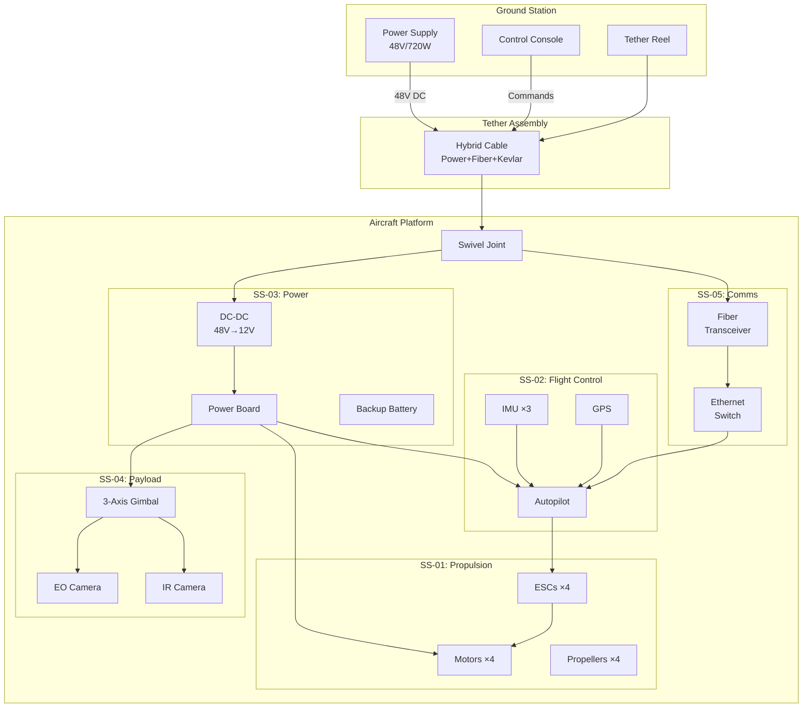

# Tethered Observation Drone - Subsystem Visualizations

## 1. Component Distribution by Subsystem

## 2. Subsystem Type Distribution

## 3. Component Origin by Country

','China','USA','Japan'],datasets:[{data:[4,4,2,1],backgroundColor:['%23FF6384','%23FFCE56','%2336A2EB','%234BC0C0']}]},options:{title:{display:true,text:'Component%20Country%20of%20Origin'}}})

## 4. COTS vs Custom Components

## 5. Power Budget by Subsystem

',data:[500,36,15,20,25],backgroundColor:'%234BC0C0'}]},options:{title:{display:true,text:'Estimated%20Power%20Consumption'},scales:{yAxes:[{ticks:{beginAtZero:true}}]}}})

## 6. System Architecture (Mermaid)

## 7. Function Hierarchy Radar

',borderColor:'%2336A2EB'}]},options:{title:{display:true,text:'Subsystem%20Documentation%20Completeness'}}})

---

## Quick Reference Links

| Chart | Direct URL |
|-------|-----------|
| Component Count | [View](https://quickchart.io/chart?c={type:'bar',data:{labels:['Propulsion','Flight%20Control','Payload','Power','Communications','Tether','Ground'],datasets:[{label:'Components',data:[3,4,4,3,3,4,4],backgroundColor:'%234BC0C0'}]}}) |
| Power Budget | [View](https://quickchart.io/chart?c={type:'bar',data:{labels:['Propulsion','Gimbal','FC','Comms','Sensors'],datasets:[{label:'Watts',data:[500,36,15,20,25],backgroundColor:'%23FF6384'}]}}) |
| Country Origin | [View](https://quickchart.io/chart?c={type:'pie',data:{labels:['Vietnam','China','USA','Japan'],datasets:[{data:[4,4,2,1]}]}}) |

